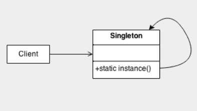
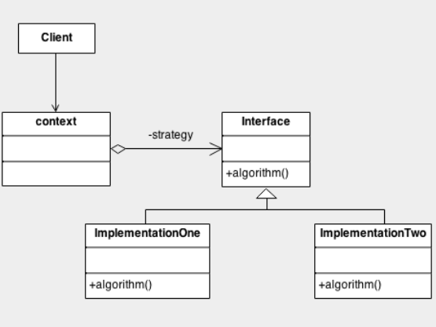
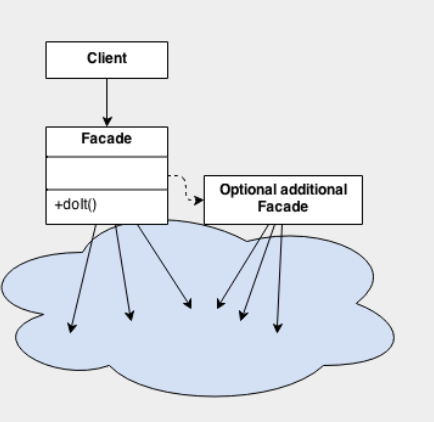

```¨PROJETO EM DESENVOLVIMENTO¨```

 <h1 align="center">
    
    <span>  Projetos na Prática com Java  (PT/BR) </span>
</h1>

<h2 align="center"> Descrição do Desafio 🫧</h2> 
<p>Agora é a sua hora de brilhar! Crie uma solução que explore o conceito de Padrões de Projeto na pŕatica. Para isso, você pode reproduzir um dos projetos que criamos durante as aulas ou, caso se sinta preparado, desenvolver uma nova ideia do zero </p>

<p><strong>Dica:</strong> Além dos projetos/repositórios que criamos para este desafio, caso queira explorar novos padrões de projeto digite no Google: “java design patterns github” ou “java design patterns examples”. Com isso, você conhecerá novos padrões e implementações de referência que podem ajudá-lo a dominar esse tema!</p>

<h2 align="center">Spring Framework 🫧</h2> 

<p>Explorando alguns padrões de projetos com Spring:</p>

> Singleton: @Bean e @Autowired;
>
> Strategy: @Service e @Repository;
>
> Facade: construiremos uma API REST com o mesmo objetivo desse padrão, abstrair a complexidade das seguintes integrações: Spring Data JPA¹ e ViaCEP (Feign).

<p>¹ Em memória (usando o “h2”).</p>


<h2 align="center">Explorando Padrões de Projetos na Prática 🫧</h2> 

<p>Repositório com as implementações dos padrões de projeto explorados no Lab "Explorando Padrões de Projetos na Prática com Java". Especificamente, este projeto explorou alguns padrões usando Java puro:</p>

> Singleton
> 
> Strategy
> 
> Facade

<h3 >Singleton </h3> 

 ```Padrão Criacional```
<p>Permitir a criação de uma única instância de uma classe e fornecer um modo para recuperá-la.</p>

 

 <h3> Strategy </h3> 

```Padrão Comportamental```
 <p>Simplificar a variação de algoritmos para a resolução de um mesmo problema.</p>

 

  <h3> Facade </h3> 

```Padrão Estrutural```
 <p>Prover uma interface que reduza a complexidade nas integrações com subsistemas.</p>

 

 <hr>

```¨PROJECT IN DEVELOPMENT¨```

<h1 align="center">
    
    <span> Practical Projects with Java (EN) </span>
</h1>

<h2 align="center"> Challenge Description 🫧</h2> 
<p>Now it's your time to shine! Create a solution that explores the concept of Design Patterns in practice. For this, you can reproduce one of the projects we created during the classes or, if you feel prepared, develop a new idea from scratch.</p>

<p><strong>Tip:</strong> In addition to the projects/repositories we created for this challenge, if you want to explore new design patterns, you can search on Google for "java design patterns github" or "java design patterns examples." This way, you will discover new patterns and reference implementations that can help you master this topic!</p>

<h2 align="center"> Spring Framework 🫧</h2> 

<p>Exploring some design patterns with Spring:</p>

> Singleton: @Bean and @Autowired;
>
> Strategy: @Service and @Repository;
>
> Facade: we will build a REST API with the same purpose as this pattern, abstracting the complexity of the following integrations: Spring Data JPA¹ and ViaCEP (Feign).

<p>¹ In-memory (using "h2").</p>

<h2 align="center">Exploring Design Patterns in Practice 🫧</h2> 

<p>Repository with implementations of design patterns explored in the "Exploring Design Patterns in Practice with Java" Lab. Specifically, this project explored some patterns using plain Java:</p>

> Singleton
> 
> Strategy
> 
> Facade

<h3>Singleton </h3> 

```Creational Pattern```
<p>Allow the creation of a single instance of a class and provide a way to retrieve it.</p>

 

 <h3> Strategy </h3> 

```Behavioral Pattern```
 <p>Simplify the variation of algorithms for solving the same problem.</p>

 

  <h3> Facade </h3> 

```Structural Pattern```
 <p>Provide an interface that reduces complexity in integrations with subsystems.</p>

 
